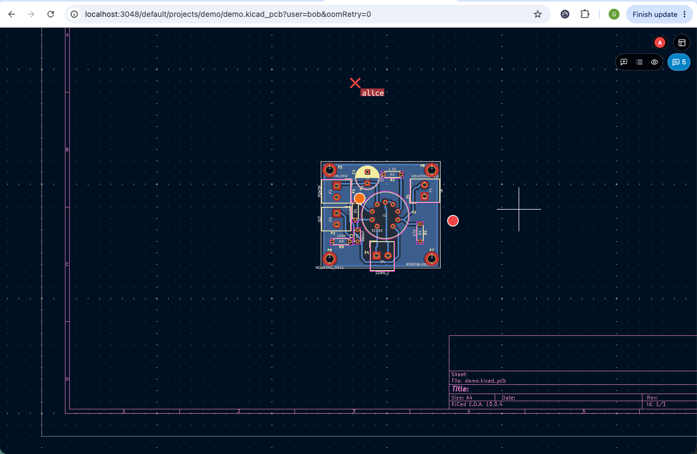

# Collab and presence

This week's hot topic was collab.

## ysync protocol
We rewrote the data structure that our ydoc holds.
The kicad files use s-expr as their "language". The problem with s-expr is that it uses tuples, which are basically arrays inside arrays.

```
(footprint "Resistor_SMD:R_0402_1005Metric"
    (layer "F.Cu")
    (uuid "fp000000-0000-4000-8000-000000000001")
    (at 116.8 88.9)
    (pad "1" smd roundrect
      (at -0.51 0)
      (size 0.54 0.64)
      (layers "F.Cu" "F.Paste" "F.Mask")
      (net 1 "GND")
      (uuid "pad00000-0000-4000-8000-000000000002"))
    (pad "2" smd roundrect ...))
```
From this file we did a `{k: "key", v: []}` key value mapping structure in our v1 ydoc model. The problem with this is the array.
An item's whole body was stored as one opaque JSON blob, so editing `a.b.[2].c.[3]` rewrote the entire body, not just the `.c.[3]` element. If two users edited different fields of the same footprint at the same time, the last writer won and the other edit was silently lost.
The array parts of the document were even worse. Y.js Y.Array can add or delete elements, but can't edit them, an edit means deleting the old element and inserting a totally new one at position `[2]`. So if somebody concurrently changed `a.b.[2].d`, they also deleted `[2]` and added back their own version of it, which effectively duplicated the original 2nd element in some (rare) cases.
To fight the whole body-rewrite, we already broke out some of the elements with uuids, but it was still not enough.
```json
{
  "fp000000-…-001": {
    "type": "footprint",
    "parent": null,
    "body": [                                      // ← ONE opaque JSON value
        { "atom": "\"Resistor_SMD:R_0402_1005Metric\"" },
        { "k": "layer", "v": [{ "atom": "\"F.Cu\"" }] },
        { "k": "uuid",  "v": [{ "atom": "\"fp000000-…-001\"" }] },
        { "k": "at",    "v": [{ "atom": "116.8" }, { "atom": "88.9" }] },
        { "item": "pad00000-…-002" },                // child pads by uuid ref
        { "item": "pad00000-…-003" }
    ]
  },
  "pad00000-…-002": {
      "type": "pad",
      "parent": "fp000000-…-001",
      "body": [
        { "atom": "\"1\"" }, { "atom": "smd" }, { "atom": "roundrect" },
        { "k": "at",     "v": [{ "atom": "-0.51" }, { "atom": "0" }] },
        { "k": "size",   "v": [{ "atom": "0.54" }, { "atom": "0.64" }] },
        { "k": "layers", "v": [{ "atom": "\"F.Cu\"" }, { "atom": "\"F.Paste\"" }, { "atom": "\"F.Mask\"" }] },
        { "k": "net",    "v": [{ "atom": "1" }, { "atom": "\"GND\"" }] },
        { "k": "uuid",   "v": [{ "atom": "\"pad00000-…-002\"" }] }
      ]
  }
}
```
So the solution was to turn as many arrays into objects as possible.

The problem with tuples is that `((a, 1), (a, 2))` is totally valid and widely used (for example in polygons we use xy lists).
Also, map keys have no order.

The idea was to use postfixes to the keys, and attribute_order arrays for sorting. The output is a bit more verbose and cryptic;
```json
{
    "fp000000-…-001": {
        "type": "footprint",
        "parent": null,
        "body": {                                      // ← Y.Map, one key per slot
          "#atom#1":  "\"Resistor_SMD:R_0402_1005Metric\"",
          "layer#1":  [{ "atom": "\"F.Cu\"" }],
          "uuid#1":   [{ "atom": "\"fp000000-…-001\"" }],
          "at#1":     [{ "atom": "116.8" }, { "atom": "88.9" }],   // atomic tuple leaf
          "#item#pad00000-…-002": 1,                   // key IS the identity; value unused
          "#item#pad00000-…-003": 1,
          "#attr_order": [                             // Y.Array order hint
            "#atom#1", "layer#1", "uuid#1", "at#1",
            "#item#pad00000-…-002", "#item#pad00000-…-003"
          ]
        }
    },
    "pad00000-…-002": {
        "type": "pad",
        "parent": "fp000000-…-001",
        "body": {
          "#atom#1": "\"1\"", "#atom#2": "smd", "#atom#3": "roundrect",
          "at#1":     [{ "atom": "-0.51" }, { "atom": "0" }],
          "size#1":   [{ "atom": "0.54" }, { "atom": "0.64" }],
          "layers#1": [{ "atom": "\"F.Cu\"" }, { "atom": "\"F.Paste\"" }, { "atom": "\"F.Mask\"" }],
          "net#1":    [{ "atom": "1" }, { "atom": "\"GND\"" }],
          "uuid#1":   [{ "atom": "\"pad00000-…-002\"" }],
          "#attr_order": ["#atom#1", "#atom#2", "#atom#3", "at#1", "size#1", "layers#1", "net#1", "uuid#1"]
        }
    }
}
```
When we moved a footprint in v1 it rewrote the whole body blob, about ~1kb retained delta per move.
In v2, moving only touches `at#1`, which is ~30b per move.
As mentioned above, if two users write the same footprint at the same time, v2 will work more robustly and closer to what is expected, with fewer edge-cases.

## Undo in collab
The previous implementation worked in a way that if `A` edited something and then `B` hit undo, it removed `A`'s edit if that was the last one.
Usually in collab you expect to only undo your own edits, so we changed the implementation to that.

## Lib sync
Previously we did the `change in editor (wasm) -> js -> server -> broadcast to other clients` flow, but the other clients were not able to do the `js -> wasm` signaling.
After this week we will be able to notify the editor that a given symbol/footprint is changed, and show a toast if it is a symbol/footprint that we are using in the current schematic/pcb.

## Presence and move locks
We added presence features, like mouse cursors, and selection highlights.
Selection highlights also work cross file, so if you select a footprint in pcb, it will highlight the symbol in schematic also.
The selected elements are "soft locked", so other users can't move them.
<video src="/blog/w28-assets/presence-and-select.mp4" autoplay loop muted playsinline></video>

We can follow another user, see what they see, and move with their cursor/viewport.
<video src="/blog/w28-assets/follow.mp4" autoplay loop muted playsinline></video>

## Comments
We can create comments. We can reply to them in threads. These are drag-and-droppable, hideable, resolve-able entities, as the small video shows.

<video src="/blog/w28-assets/comments.mp4" autoplay loop muted playsinline></video>

# Platform
We started to work on the platform itself, we had meetings about the internal structure, what should be a paid and what should be a free feature, we planned a lot of the future features also.

## Auth, teams, privacy
Our main grouping block will be the teams. When you register you will automatically get a personal team. Later you can create teams for your company, or join other teams.

Inside teams you can create public or private projects and libs. We will handle multiple team roles, and in general we want to do something like github did with the opensource (software) world, but for hardware. (You can work in private, but you will have less limitations if you work in public.)

We implemented the auth part, emails, logins, team and project creation, and some of the roles.

Also, we added CI/CD, and this week we want to push out a closed beta from this.

# General improvements
We did some general improvements that are not directly related to the two main topics, but still worth mentioning, because they are important for the later features.

## Mobile/reduced/readonly view added
We added a view where we hide most of the wxwidgets UI. We will use this for a read-only view.
Also, we made it touch friendlier, so it can be used on mobile devices.



## Step export fixes
We fixed the step export, now it downloads the needed model files before it tries to add it to the output model.
I'm not a hundred percent sure that this will work right after our next demo deploy, but fingers crossed, it works on my machine, and in e2e test.

## CLI
We removed the `sym_converter` wasm output and changed to `kicad_tools`.
We added some flags to it, so it can DRC, ERC, export gerbers, convert file types, lint s-expr; overall a more useful tool that we will use later for server-side validations.

## Site & test hygiene

The site got some necessary improvements (like the build sha is fixed, and an early version of the pricing page got added).

We sped up our e2e tests (no more blind sleeps, we prefer deterministic awaits), added more stable screenshots, and fixed some flaky tests.
